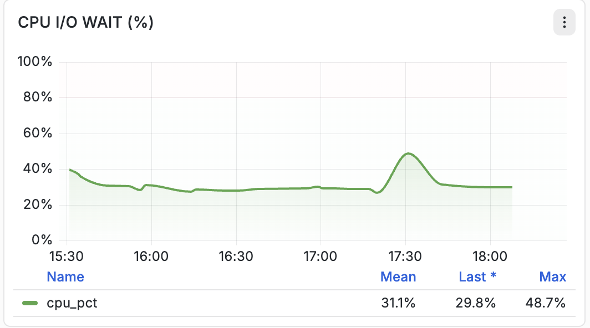

# 호스트 인프라 모니터링 대시보드

이 섹션에서는 인프라 모니터링 대시보드에 표시되는 각 호스트 수준 인프라 모니터링 그래프에 대해 설명합니다. 각 섹션에서는 지표의 목적, 수집 중인 데이터, 측정 단위 및 시각화에 제시된 정보에 대해 설명합니다.

## 대시보드 개요

호스트 인프라 모니터링 대시보드는 기본 호스트의 사용률과 성능을 실시간으로 확인할 수 있습니다. 이러한 지표는 운영자가 컴퓨팅, 메모리, 스토리지 및 네트워크 리소스를 모니터링하면서 잠재적인 리소스 병목 현상을 식별하는 데 도움이 됩니다.

대시보드에는 다음 모니터링 패널이 포함되어 있습니다.

- 호스트 CPU 사용률
- 호스트 디스크 I/O
- 호스트 네트워크 I/O
- CPU I/O 대기
- 스토리지 사용량
- 디스크 사용량
- 호스트 CPU 로드 평균
- 호스트 메모리 사용

## &#x200B;1. 호스트 CPU 사용률

### 설명

**[!UICONTROL 호스트 CPU 사용률]** 패널에는 운영 체제와 시간이 지남에 따라 실행 중인 모든 프로세스에서 현재 사용하고 있는 CPU 리소스의 비율이 표시됩니다.

이 지표는 호스트 전체의 전체 CPU 사용을 나타내며 프로세서 활동의 시계열 시각화를 제공합니다.

이 그래프를 통해 운영자는 선택한 관찰 기간 동안 CPU 소비가 어떻게 변하는지를 모니터링할 수 있습니다.

### 지표

| 지표 | 설명 |
| --------- | ---------------------------------------- |
| `cpu_pct` | 현재 사용 중인 총 CPU의 백분율 |

### 단위

- 백분율(%)

### 표시된 통계

패널에는 다음 세 가지 값을 사용하여 CPU 활용도가 요약됩니다.

| 통계 | 설명 |
| --------- | --------------------------------------------------------------- |
| 평균 | 선택한 시간 범위 동안의 평균 CPU 사용률 |
| 지난 | 가장 최근에 수집된 CPU 활용 값 |
| 최대 | 선택한 시간 범위 동안 관찰된 가장 높은 CPU 사용률 |

### 그래프 구성 요소

- CPU 사용률을 나타내는 시계열 라인.
- **0%에서 100%** 범위의 백분율 기반 Y축입니다.
- 그래프 아래에 표시되는 요약 통계입니다.
- 선택한 모니터링 간격에 대한 기록 트렌드입니다.

## &#x200B;2. 호스트 디스크 I/O

### 설명

**[!UICONTROL 호스트 디스크 I/O]** 패널에 호스트에서 수행한 디스크 읽기 및 디스크 쓰기 작업에 대한 저장소 처리량이 표시됩니다.

그래프는 운영 체제와 저장 장치 간에 전송되는 데이터를 나타내는 두 개의 독립적인 시계열을 나타낸다.

이 시각화는 시간이 지남에 따라 스토리지 활동을 모니터링하는 데 도움이 되며 insight을 디스크에서 읽고 디스크에 쓰는 데이터의 볼륨에 제공합니다.

### 지표

| 지표 | 설명 |
| ------------ | --------------------------------- |
| `disk_read` | 스토리지에서 읽은 데이터 양 |
| `disk_write` | 스토리지에 기록된 데이터 양 |

내부적으로 이들 지표는 매끄러운 처리량 값을 사용하여 표시됩니다.

### 단위

- 초당 바이트 수(B/s)
- 초당 킬로바이트(KB/초)
- 초당 메가바이트(MB/초)
- 초당 기가바이트(GB/s)

표시된 단위는 처리량에 따라 자동으로 크기가 조정됩니다.

### 그래프 구성 요소

- 디스크 읽기 처리량을 나타내는 녹색 줄입니다.
- 디스크 쓰기 처리량을 나타내는 주황색 줄입니다.
- 시계열 시각화.
- 각 지표에 대한 범례를 구분합니다.
- 각 시리즈 옆에 표시되는 현재 지표 값입니다.

## &#x200B;3. 호스트 네트워크 I/O

### 설명

**[!UICONTROL 호스트 네트워크 I/O]** 패널에 시간이 지남에 따라 호스트가 보내고 받는 네트워크 트래픽 볼륨이 표시됩니다.

그래프는 데이터가 네트워크 인터페이스를 통해 흐르는 속도를 측정하고 네트워크 대역폭 사용량에 대한 가시성을 제공합니다.
이 지표는 전체 네트워크 처리량을 나타냅니다.

### 지표

| 지표 | 설명 |
| --------------- | --------------------------------------------------------------------- |
| `bytes_per_sec` | 초당 전송된 바이트로 측정된 총 네트워크 처리량 |

### 단위

그래프는 다음 사이에서 자동으로 크기가 조정됩니다.

- 바이트/초
- KB/초
- MB/초
- GB/초

관찰된 트래픽 볼륨에 따라 다릅니다.

### 표시된 통계

| 통계 | 설명 |
| --------- | ---------------------------------- |
| 평균 | 평균 네트워크 처리량 |
| 지난 | 가장 최근 처리량 측정 |
| 최대 | 관찰된 최고 처리량 |

### 그래프 구성 요소

- 단일 처리량 라인
- 시계열 시각화.
- 동적 대역폭 확장.
- 차트 아래에 표시되는 요약 통계입니다.

## &#x200B;4. CPU I/O 대기

### 설명

**[!UICONTROL CPU I/O 대기]** 패널에 입력/출력 작업이 완료되기를 기다리는 동안 소요된 CPU 시간의 백분율이 표시됩니다.

이 지표는 저장 장치 또는 기타 I/O 작업을 기다리는 동안 활성 프로세스가 차단되므로 발생하는 프로세서 유휴 시간을 나타냅니다.

이 그래프는 시간이 지남에 따라 I/O 대기가 변경되는 방식을 시각화합니다.

### 지표

| 지표 | 설명 |
| --------- | ------------------------------------------------------ |
| `cpu_pct` | I/O 작업 대기 중 CPU 체류 시간의 백분율 |

### 단위

- 백분율(%)

### 표시된 통계

| 통계 | 설명 |
| --------- | ------------------------------- |
| 평균 | 평균 CPU I/O 대기 백분율 |
| 지난 | 가장 최근에 기록된 값 |
| 최대 | 가장 높은 기록 값 |

### 그래프 구성 요소

- 시계열 라인
- 백분율 기반 Y축입니다.
- 요약 통계입니다.
- 기록 트렌드 시각화.

## &#x200B;5. 스토리지 사용량

### 설명

**[!UICONTROL 저장소 사용량]** 패널에는 현재 모니터링되는 호스트에서 사용되는 전체 저장소 용량 비율이 표시됩니다.

그래프는 선택한 시간 간격 동안의 파일 시스템 용량 사용률에 대한 기록 보기를 제공합니다.

### 지표

| 지표 | 설명 |
| --------------- | -------------------------------------------------- |
| 스토리지 사용량 % | 현재 소비된 할당된 스토리지 비율 |

### 단위

- 백분율(%)

### 그래프 구성 요소

- 시계열 활용성 그래프.
- 백분율 단위입니다.
- 과거 스토리지 활용도 추세

## &#x200B;6. 디스크 사용량

### 설명

**[!UICONTROL 디스크 사용량]** 패널에 마운트된 각 파일 시스템 또는 저장소 장치의 저장소 사용률이 표시됩니다.

각 행은 특정 블록 장치 또는 마운트된 파티션에 해당하며 현재 사용 중인 공간의 비율을 보고합니다.

이 표에는 스토리지 활용도에 대한 파일 시스템 수준의 분류가 나와 있습니다.

### 표시된 정보

각 항목에는 다음이 포함됩니다.

| 필드 | 설명 |
| --------------- | -------------------------------------------- |
| 디바이스 | 마운트된 스토리지 디바이스 또는 파일 시스템 |
| 사용률(%) | 스토리지 용량 활용률 |
| 활용성 막대 | 스토리지 사용량의 시각적 표현 |

### 단위

- 백분율(%)

### 그래프 구성 요소

- 파일 시스템/디바이스 목록.
- 활용률 백분율.
- 색상 코드 용량 표시기.
- 사용률 값이 정렬되었습니다.

## &#x200B;7. 호스트 CPU 로드 평균

### 설명

**[!UICONTROL 호스트 CPU 로드 평균]** 패널에 세 번의 롤링 기간 동안의 Linux 시스템 로드 평균이 표시됩니다.

로드 평균은 CPU 사용률과 달리 실행 중이거나 CPU 예약 또는 I/O 완료를 기다리는 평균 프로세스 수를 나타냅니다.

그래프는 단기 및 장기 작업 로드 추세를 제공하는 세 개의 롤링 평균을 동시에 표시합니다.

### 지표

| 지표 | 설명 |
| ---------- | -------------------------------------------- |
| `load_1m` | 지난 1분 동안의 평균 시스템 로드 |
| `load_5m` | 지난 5분 동안의 평균 시스템 로드 |
| `load_15m` | 지난 15분 동안의 평균 시스템 로드 |

### 단위

- 평균 로드(무차원 값)

### 표시된 통계

각 로드 평균 지표에 대해:

| 통계 | 설명 |
| --------- | --------------------------------------- |
| 평균 | 선택한 시간 범위 동안의 평균 로드 |
| 지난 | 최근 기록된 로드 값 |
| 최대 | 관찰된 가장 높은 로드 값 |

### 그래프 구성 요소

- 세 개의 독립적인 추세선입니다.
- 시계열 시각화.
- 각 롤링 평균에 대한 개별 범례.
- 각 지표에 대한 요약 통계입니다.

## &#x200B;8. 호스트 메모리 사용

### 설명

**[!UICONTROL 호스트 메모리 사용량]** 패널에 운영 체제에서 현재 할당한 실제 시스템 메모리의 비율이 표시됩니다.

이 지표는 실행 중인 모든 프로세스, 커널 메모리, 버퍼 및 캐시에 대한 전체 RAM 사용률을 나타냅니다.

그래프는 선택된 모니터링 기간 동안의 메모리 소모에 대한 연속 뷰를 제공한다.

### 지표

| 지표 | 설명 |
| ------------ | ---------------------------------------------- |
| `memory_pct` | 현재 사용 중인 실제 메모리의 백분율 |

### 단위

- 백분율(%)

### 표시된 통계

| 통계 | 설명 |
| --------- | ---------------------------------- |
| 평균 | 평균 메모리 사용률 |
| 지난 | 가장 최근에 기록된 활용률 |
| 최대 | 가장 높은 활용도 관찰됨 |

### 그래프 구성 요소

- 시계열 메모리 사용률 그래프.
- 백분율 기반 Y축입니다.
- 과거 활용 추세.
- 요약 통계입니다.

## 대시보드 지표 요약

| 대시보드 패널 | 기본 지표 | 단위 |
| --------------------- | -------------------------------- | ------------ |
| 호스트 CPU 사용률 | `cpu_pct` | % |
| 호스트 디스크 I/O | `disk_read`, `disk_write` | 바이트/초 |
| 호스트 네트워크 I/O | `bytes_per_sec` | 바이트/초 |
| CPU I/O 대기 | `cpu_pct` | % |
| 스토리지 사용량 | 스토리지 사용량 % | % |
| 디스크 사용량 | 파일 시스템 사용 | % |
| 호스트 CPU 로드 평균 | `load_1m`, `load_5m`, `load_15m` | 평균 로드 |
| 호스트 메모리 사용 | `memory_pct` | % |
