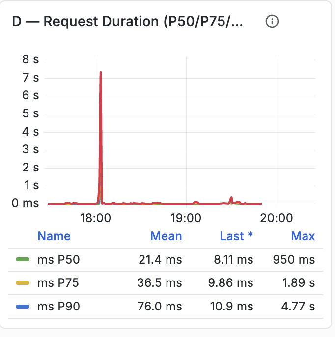
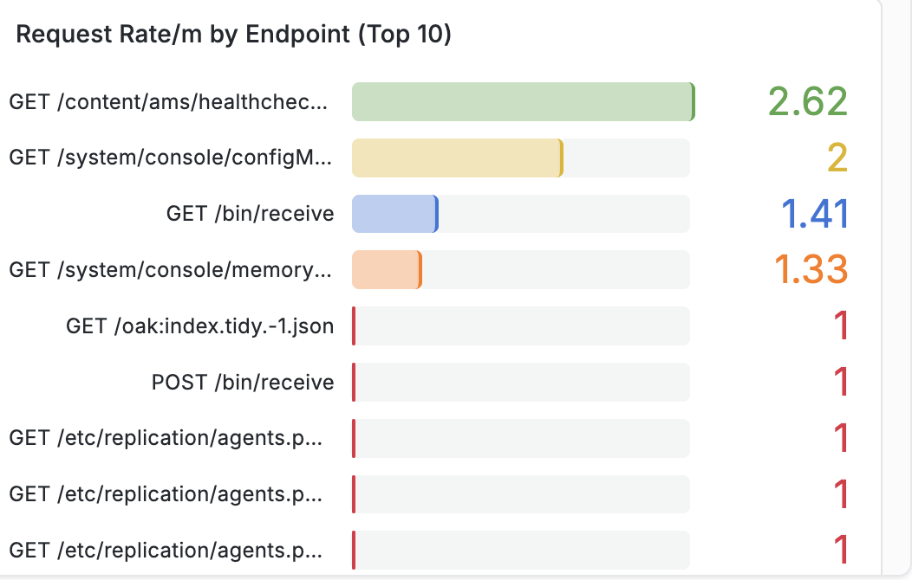

# APM 대시보드 참조 {#apm-dashboard-reference}

이 참조는 AEM Managed Services에서 사용되는 기본 Observability Insights APM 패널을 설명합니다.

## 대시보드 탐색


대시보드는 관련 애플리케이션 성능 지표를 그룹화하는 확장 가능한 섹션으로 구성됩니다. 섹션을 확장하면 해당 카테고리와 연결된 하나 이상의 차트가 표시됩니다.

## 개요


### 설명

**개요** 섹션에는 모니터링되는 응용 프로그램의 현재 상태를 요약하는 높은 수준의 KPI(주요 성능 지표)가 표시됩니다.

이러한 KPI는 애플리케이션 작업, 처리량, 요청 성공 및 전체 사용자 경험에 대한 요약 정보를 제공합니다.

### 지표

#### 총 요청 수

선택한 시간 범위 동안 응용 프로그램에서 처리한 총 요청 수를 표시합니다.

**지표**

```
total_requests
```

**단위**

- 계수

#### 현재 처리량

현재 요청 처리 속도를 표시합니다.

**지표**

```
throughput
```

**단위**

- 초당 요청 수(req/s)

#### 현재 오류율

오류의 원인이 되는 요청의 비율을 표시합니다.

**지표**

```
error_rate
```

**단위**

- 백분율(%)

#### APDEX 점수

애플리케이션 응답 시간을 기준으로 최종 사용자 만족도를 표준화한 APDEX(애플리케이션 성능 지수)를 표시합니다.

구성된 임계값이 위젯 내에 표시됩니다.

**지표**

```
apdex_score
```

**단위**

- 점수(0.0 - 1.0)

## 빨간색 지표

RED 방법론은 애플리케이션의 세 가지 주요 특성을 측정합니다.

- **속도**
- **오류**
- **기간**

### 요청 비율


#### 설명

시간이 지남에 따라 받은 애플리케이션 요청 수를 표시합니다.

이 그래프는 시계열 시각화를 사용하여 요청 처리량을 나타냅니다.

#### 지표

```
req_min
```

#### 단위

- 분당 요청 수(req/m)

#### 표시된 정보

- 시계열 요청 속도
- 내역 요청 활동
- 요청 속도 트렌드
- 지표 범례

### 오류율


#### 설명

오류가 발생한 요청의 백분율을 표시합니다.

이 차트는 과거 및 현재 오류 비율을 비교합니다.

#### 지표

```
error_pct (now)
error_pct (1h ago)
```

#### 단위

- 백분율(%)

#### 표시된 정보

- 현재 오류 백분율
- 기록 비교
- 평균 값
- 시계열 트렌드

### 요청 기간



#### 설명

여러 응답 시간 백분위수에 걸쳐 요청 지연을 표시합니다.

그래프는 선택한 관찰 기간 동안 수집된 백분위수 지연 측정을 동시에 플롯합니다.

#### 지표

```
P50
P75
P90
```

#### 단위

- 밀리초(ms)
- 초(초)

응답 기간에 따라 단위가 자동으로 조정됩니다.

#### 표시된 통계

모든 백분위수에 대해:

- 평균
- 지난
- 최대

#### 백분위수 정의

| 지표 | 설명 |
| ------ | ----------------------------- |
| P50 | 50백분위수 응답 시간 |
| P75 | 75백분위수 응답 시간 |
| P90 | 90백분위수 응답 시간 |

## 트래픽

### HTTP 상태 코드별 요청


#### 설명

HTTP 응답 상태 코드별로 그룹화된 요청 처리량을 표시합니다.

각 상태 코드는 시간이 지남에 따라 독립적으로 그려집니다.

#### 지표

일반적인 지표는 다음과 같습니다.

```
req_s 200
req_s 300
req_s 400
req_s 500
```

애플리케이션 활동에 따라 다릅니다.

#### 단위

- 초당 요청 수(req/s)

#### 표시된 정보

- HTTP 상태별 처리량
- 평균 처리량
- 최신 처리량
- 최대 처리량
- 시계열 활동

### 끝점별 요청 속도

끝점별 

#### 설명

요청 비율별로 순위가 매겨진 가장 높은 트래픽 애플리케이션 끝점을 표시합니다.

각 끝점은 요청 볼륨을 나타내는 가로 막대로 표시됩니다.

#### 지표

```
endpoint_request_rate
```

#### 단위

- 분당 요청 수(req/m)

#### 표시된 정보

- 끝점 경로
- 요청 비율
- 등급 엔드포인트 목록
- 상대 요청 볼륨

## 지연 시간 및 성능

### 응답 시간 — P95와 1시간


#### 설명

현재 P95 응답 시간과 한 시간 전에 기록된 P95 응답 시간의 비교를 표시합니다.

두 데이터 세트가 동일한 시계열 그래프에 표시됩니다.

#### 지표

```
P95 (Current)
P95 (1 Hour Ago)
```

#### 단위

- 밀리초(ms)
- 초(초)

#### 표시된 통계

- 평균
- 지난
- 최대

### 시간 경과에 따른 APDEX 점수


#### 설명

응용 프로그램 성능 지수를 연속 시계열로 표시합니다.

그래프는 선택한 모니터링 간격 전체에 걸쳐 APDEX 값을 시각화합니다.

#### 지표

```
APDEX Score
```

#### 단위

- 점수(0.0-1.0)

#### 표시된 통계

- 평균
- 지난
- 최대

### 처리량과 P95 지연


#### 설명

동일한 타임라인에서 요청 처리량 및 P95 응답 지연을 표시합니다.

그래프는 트래픽 볼륨과 응답 지연을 동시에 시각화할 수 있습니다.

#### 지표

```
Throughput
P95 Latency
```

#### 단위

| 지표 | 단위 |
| ----------- | ------------ |
| 처리량 | 요청/초 |
| P95 지연 | 밀리초 |

#### 표시된 정보

- 시계열 처리량
- 시계열 지연
- 이중 지표 비교

## 오류 세부 사항

### 상태 그룹별 오류율 %


#### 설명

HTTP 응답 클래스별로 그룹화된 응용 프로그램 오류 백분율을 표시합니다.

각 응답 범주에 대해 별도의 시리즈가 표시됩니다.

#### 지표

일반적인 그룹은 다음과 같습니다.

```
2xx
3xx
4xx
5xx
Combined Error Trend
```

관찰된 트래픽에 따라 다릅니다.

#### 단위

- 백분율(%)

#### 표시된 정보

- 응답 클래스별 오류 백분율
- 평균 오차 백분율
- 시계열 트렌드

### 오류율 트렌드 — 이제 와 1시간 전


#### 설명

한 시간 전에 기록된 오류율과 함께 현재 애플리케이션 오류율을 표시합니다.

#### 지표

```
Current Error Ratio
1 Hour Error Ratio
```

#### 단위

- 백분율(%)

#### 표시된 정보

- 현재 트렌드
- 기록 비교
- 시계열 시각화

### 오류율 트렌드 — 이제 와 6시간 전


#### 설명

6시간 전에 기록된 오류율과 함께 현재 애플리케이션 오류율을 표시합니다.

#### 지표

```
Current Error Ratio
6 Hour Error Ratio
```

#### 단위

- 백분율(%)

#### 표시된 정보

- 현재 오류 비율
- 기록 비교
- 시계열 시각화

## 대시보드 지표 요약

| 대시보드 | 기본 지표 |
| -------------------------- | --------------------------------------------- |
| 개요 | 총 요청, 처리량, 오류율, APDEX |
| 요청 비율 | 분당 요청 수 |
| 오류율 | 오류 백분율 |
| 요청 기간 | P50, P75, P90 지연 |
| 상태 코드별 요청 | HTTP 상태 처리량 |
| 끝점별 요청 속도 | 끝점 요청 볼륨 |
| 응답 시간 비교 | 현재 및 이전 P95 |
| APDEX 점수 | 사용자 만족도 지수 |
| 처리량과 지연 시간 | 요청 처리량 및 P95 지연 |
| 상태 그룹별 오류율 | HTTP 상태 그룹 오류 비율 |
| 오류 비율 트렌드 | 현재 및 이전 오류 비율 |
